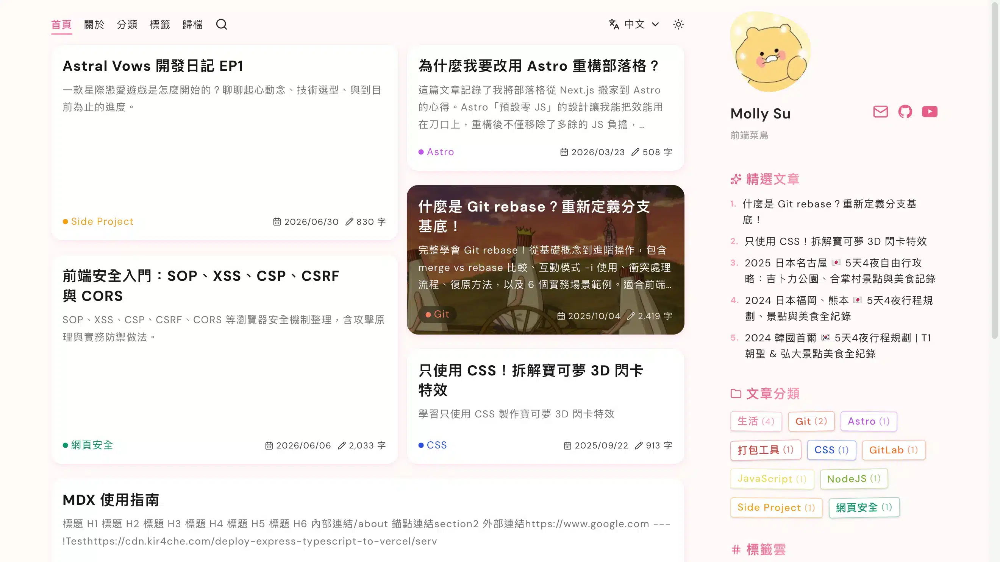

<div align="center">

# kir4che-blog

**個人部落格 — 從零建置 · 自訂 MDX 元件 · Keystatic CMS**

[kir4che.com](https://kir4che.com)



</div>

以 **Astro 7 + React 19** 建構，支援**繁體中文（預設）與英文**雙語，部署於 Vercel。後台使用 **Keystatic** 開源 CMS，提供結構化 MDX 編輯與 GitHub OAuth 認證。

## 專案特色

| 面向         | 內容                                                                                                       |
| ------------ | ---------------------------------------------------------------------------------------------------------- |
| **寫作系統** | Astro Content Collections 管理 MDX 文章，搭配 22 個自訂元件、分類、標籤、草稿狀態。                        |
| **內容管理** | Keystatic 提供結構化 MDX 編輯；本機直接寫檔，production 透過 GitHub storage 寫入 repo。                    |
| **閱讀體驗** | 支援目錄、圖片燈箱、相關文章、Utterances 留言、自製 CJK 搜尋、旅遊地圖、密碼保護、動態 OG 圖片與深色主題。 |
| **部署方式** | 多數頁面靜態預渲染，密碼驗證與 OG 圖片由 server routes 處理，部署於 Vercel。                               |

## 快速開始

```sh
pnpm install
pnpm dev               # http://localhost:4321
```

Keystatic 後台位於 `/keystatic`，本機開發時使用 local storage，直接讀寫 `src/content/blog/`。

```sh
pnpm build             # 正式建置
pnpm preview           # 預覽建置結果
pnpm format:check      # 檢查格式
pnpm new-post          # 快速建立新文章
```

## 技術棧

| 層       | 技術                                                                    |
| -------- | ----------------------------------------------------------------------- |
| 框架     | Astro 7 + React 19 (Islands) + Vite 8 + TypeScript 6                    |
| 樣式     | Tailwind CSS 4 + DaisyUI 5 + tailwind-merge                             |
| 內容     | MDX + Content Collections (Zod schema) + Expressive Code                |
| 圖片處理 | sharp + Astro `<Image>` (多尺寸 WebP/AVIF) + yet-another-react-lightbox |
| CMS      | Keystatic (GitHub-backed, 22 個自訂 MDX 元件)                           |
| 安全     | env-only 密碼 + Upstash Ratelimit sliding window                        |
| 部署     | Vercel (SSG + server routes)                                            |
